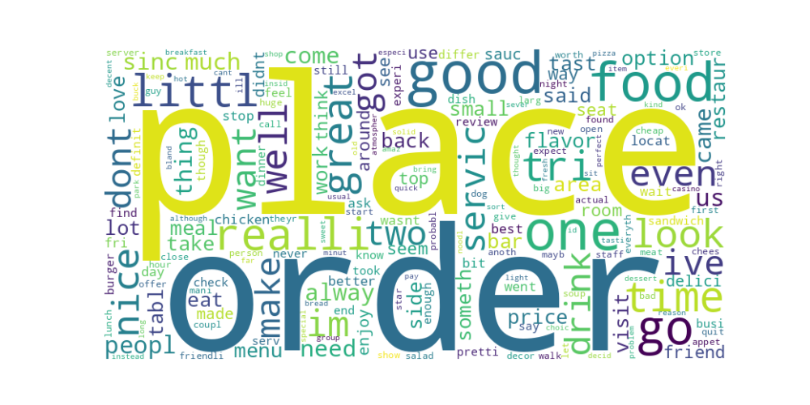
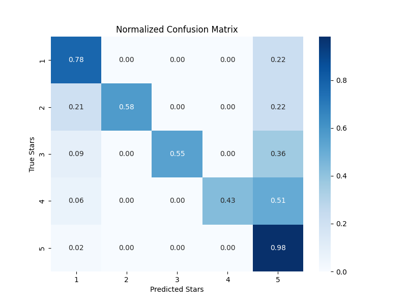

# 📝 Yelp Review Sentiment Analyzer


> An interactive and data-rich NLP project that uses machine learning to analyze and classify Yelp reviews based on sentiment.

---

## 📸 Preview

<table>
  <tr>
    <td></td>
    <td></td>
  </tr>
  <tr>
    <td align="center">WordCloud of Frequent Words</td>
    <td align="center">Model Confusion Matrix</td>
  </tr>
</table>

---

## 🚀 Key Features

✨ **Data Cleaning & Preprocessing**  
🔍 **NLP with NLTK**  
📊 **Text & Star Rating Visual Analysis**  
☁️ **WordCloud Generation**  
🧠 **Classification with Naive Bayes & Random Forest**  
📈 **Model Evaluation with Accuracy & Confusion Matrix**

---

## 📁 Project Structure

```bash
yelp-review-analyzer/
├── yelp_rating.csv              # Dataset
├── review_analysis.ipynb        # Jupyter Notebook
├── wordcloud.png                # WordCloud output
├── confusion_matrix.png         # Confusion matrix output
├── requirements.txt             # Python dependencies
└── README.md                    # Project documentation
```

---

##🚀 How to Run

1.Clone the repository:

```bash
git clone https://github.com/yourusername/yelp-review-analyzer.git
cd yelp-review-analyzer
```

2.Place your yelp_rating.csv dataset in the project directory.

3.Run the notebook or script:

```bash
jupyter notebook review_analysis.ipynb
```

---

##📊 Sample Output

Here’s what the top of the dataset looks like:

stars       text	               useful	       funny	    cool	    text length
5	          Super simple place
            but amazing ...	     0	           0	        0	        213

4	          Love coming here. 
            Yes the place ...	   0	           0	        0	        523


The project calculates statistics such as:
-Average text length per star rating
-Most common words
-WordClouds for visual insight
-Classifier performance metrics

---

##📈 Model Evaluation
This project includes model training and testing using:
-Naive Bayes
-Random Forest

Evaluation metrics:
-Accuracy Score
-Confusion Matrix
-Classification Report

---

##🧹 Preprocessing Steps
-Stopword removal using nltk
-Tokenization and vectorization with CountVectorizer and TfidfTransformer
-Dropping unnecessary columns like date, business_id, review_id, and user_id
-Adding a text length feature

---

##📝 License
This project is open source and available under the MIT License.

---

##🙌 Acknowledgements
Thanks to the Yelp dataset and the open-source community behind Python's data science tools.

---

##💬 Contact
For questions or feedback, feel free to open an issue or contact akhilsai96@gmail.com
